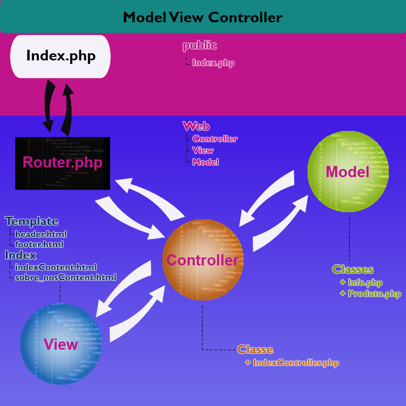

<h1>Arquitetura MVC</h1>

<h2>Descrição</h2>

 Este projeto é um modelo de arquetura em camadas para desenvolvimento de softwares em php. 
A arquitetura MVC foi formulado para criar um padrão de desenvolvimento com camadas bem definidas, orientado a padronização
e a produtividade do software.

<h2>View</h1>

<ul>
  <li>Camada de interface do usuário;</li>
  <li>HTML e XML.</li>
</ul>

<h2>Model</h1>

<ul>
  <li>Camada encarregada das regras de negócio;</li>
  <li>MySql e JSON;</li>
  <li>Os dados sáo capturados e enviados para o controlador.</li>
</ul>

<h2>Controller</h1>

<ul>
  <li>Sua função é notificar a camada view ou model de acordo com a requisição recebida.</li>
</ul>

<h2> Interação das entidades</h2>

Imagem ilustrativa demonstrando o comportamento deste projeto.

<h2> Como usar</h2>

<h3>Route</h3>

O arquivo Route.php contém um array com as rotas que vão chegar ao controlador para acionar o tipo de view e o modelo de negócio

